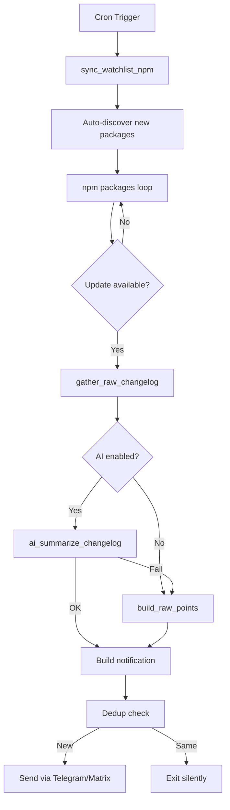

<p align="center">
  <h1 align="center">🦞 OpenClaw Update Scripts</h1>
  <p align="center">
    Automated package monitoring, AI-powered changelogs, and one-click updates via Telegram & Matrix.
  </p>
</p>

<p align="center">
  
  
  
  
</p>

---

## What It Does

Watches your globally-installed npm, snap, and go packages for updates and notifies you via **Telegram** or **Matrix** with rich UI — including changelog summaries, per-package buttons, and one-click update confirmation.

```
🔔 Update verfügbar (13.03.2026 18:02)
━━━━━━━━━━━━━━━━━━━━━━━━━

📦 3 Update(s) gefunden:

• openclaw: 2026.3.2 → 2026.3.11
  📋 Neues Plugin-System für benutzerdefinierte Erweiterungen
  📋 Verbesserte CLI-Performance bei großen Workspaces
  📋 Bugfix für Matrix-Nachrichtenformatierung

• @anthropic-ai/claude-code: 2.1.74 → 2.1.75
  📋 ...

━━━━━━━━━━━━━━━━━━━━━━━━━
Soll i updaten?

[✅ Alle updaten] [❌ Nein, danke]
[📦 openclaw] [📦 claude-code]
```

## Features

| Feature | Description |
|---------|-------------|
| 🔔 **Smart Notifications** | Telegram + Matrix with dedup (won't spam on repeated checks) |
| 🤖 **AI Changelogs** | Summarizes release notes into 3 bullet points via OpenClaw AI |
| 📦 **Auto-Discovery** | Detects newly-installed global npm packages automatically |
| 🛠 **Auto-Heal** | Self-repairs on critical failures (with 6h cooldown) |
| ⚡ **Cached Lookups** | Single `npm ls -g` call cached across all package checks |
| 🧪 **E2E Tests** | 234 mocked tests (53 suites) + Docker integration suite (60 assertions) |
| 🔄 **Multi-Channel** | Telegram, Matrix, or both simultaneously |

## Architecture

```
openclaw-update-scripts/
├── lib/
│   └── common.sh              # Shared library (700+ lines)
│                               #   ├── Version comparison (sort -V)
│                               #   ├── Safe execution (timeout + retry)
│                               #   ├── npm cache + version lookups
│                               #   ├── Messaging (Telegram / Matrix)
│                               #   ├── GitHub release + npm changelog
│                               #   ├── AI summarization (OpenClaw agent)
│                               #   ├── Dynamic package discovery
│                               #   ├── Watchlist sync (batched jq)
│                               #   └── Update runner (shared logic)
├── cron/
│   ├── check-updates-notify.sh # Cron: check for updates → notify
│   ├── run-all-updates.sh      # Run all updates (via subagent)
│   ├── run-all-updates-direct.sh # Run all updates (direct)
│   ├── run-all-updates-via-subagent.sh # Delegates to AI subagent
│   ├── auto-update-all.sh      # Auto-update core packages
│   └── update-watchlist.json   # Package watchlist
├── scripts/
│   ├── e2e-update-check-validation.sh # Mocked test suite (234 tests)
│   ├── docker-e2e-test.sh      # Docker E2E test (60 assertions)
│   └── run-docker-e2e.sh       # Docker test runner
├── SKILL.md                    # AI-agent skill instructions
├── Dockerfile.e2e              # E2E test container
├── INSTALL.md                  # Full setup guide
└── README.md
```

## Quick Start

```bash
# 1. Clone
git clone https://github.com/servas-ai/openclaw-update-scripts.git
cd openclaw-update-scripts

# 2. Make executable
chmod +x cron/*.sh scripts/*.sh

# 3. Test (dry-run, no messages sent)
DRY_RUN=1 FORCE_NOTIFY=1 bash cron/check-updates-notify.sh

# 4. Run tests
bash scripts/e2e-update-check-validation.sh
```

## Configuration

### Watchlist (`cron/update-watchlist.json`)

```json
{
  "npm": ["openclaw", "@anthropic-ai/claude-code", "npm", "vibe-kanban"],
  "npm_exclude": ["create-better-openclaw"],
  "snap": ["chromium", "snapd"],
  "go": ["gt"]
}
```

New globally-installed npm packages are **auto-discovered** and added on each check. Packages you don't want tracked go in `npm_exclude`.

### Environment Variables

| Variable | Default | Description |
|----------|---------|-------------|
| `CHAT_ID` | `-1003766760589` | Telegram Chat-ID / Matrix Room |
| `THREAD_ID` | `16` | Telegram Forum Thread-ID |
| `CHANNEL` | `telegram` | `telegram`, `matrix`, or `both` |
| `DRY_RUN` | `0` | Print output without sending |
| `FORCE_NOTIFY` | `0` | Send even if nothing changed |
| `AI_SUMMARIZE` | `auto` | AI summaries: `auto`, `1`, `0` |
| `AI_SUMMARIZE_TIMEOUT` | `30` | AI response timeout (seconds) |
| `SAFE_TIMEOUT_SEC` | `30` | npm lookup timeout (seconds) |
| `AUTO_HEAL_ENABLED` | `1` | Auto-repair on critical failures |
| `TELEGRAM_NOTIFY` | `1` | Send completion report |

### Cron Setup

```bash
# Check every 30 minutes
*/30 * * * * cd /path/to/openclaw-update-scripts && bash cron/check-updates-notify.sh

# Daily auto-update at 03:00 (optional)
0 3 * * * cd /path/to/openclaw-update-scripts && bash cron/auto-update-all.sh
```

## AI Changelog Summarization

When enabled, release notes are fetched from **GitHub Releases** + **npm** and summarized into 3 concise bullet points via `openclaw agent --local`.

The AI model is configurable — works with any OpenAI-compatible API:

```bash
openclaw config set models.providers.my-api.baseUrl "https://api.example.com/v1"
openclaw config set models.providers.my-api.apiKey "sk-..."
openclaw config set models.providers.my-api.api "openai-completions"
```

Falls back to raw changelog extraction if AI is unavailable.

## Testing

```bash
# Mocked unit + integration tests (no network)
bash scripts/e2e-update-check-validation.sh
# Expected: ✅ ALL TESTS PASSED: 234/234

# Docker E2E (full environment, requires Docker)
bash scripts/run-docker-e2e.sh
# Expected: ✅ ALL TESTS PASSED: 60/60

# Live dry-run (real network, no messages sent)
DRY_RUN=1 FORCE_NOTIFY=1 bash cron/check-updates-notify.sh
```

## How It Works



## AI Agent Integration

This project includes a **[SKILL.md](SKILL.md)** — a machine-readable instruction file that enables AI coding agents (OpenClaw, Codex, Claude, etc.) to:

- **Install and configure** the entire system autonomously
- **Understand the function API** (30+ documented functions with signatures)
- **Modify the codebase** using the modification guide
- **Troubleshoot** common issues using the diagnostic table
- **Operate** the scripts via documented data flow

AI agents should read `SKILL.md` first for complete context.

## Full Setup

See **[INSTALL.md](INSTALL.md)** for the complete step-by-step installation guide with:
- ✅ Verification commands for each step
- Prerequisites check/install table
- 3 model provider options (custom proxy, OpenAI direct, no AI)
- Custom agent configuration with system prompts
- Cron setup and troubleshooting

## License

MIT
