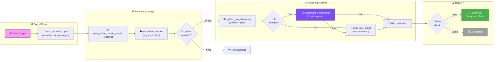

<p align="center">
  
  <h1 align="center">🦞 OpenClaw Update Scripts</h1>
  <p align="center">
    <strong>Automated package monitoring · AI-powered changelogs · One-click updates</strong>
  </p>
  <p align="center">
    Never miss a package update again. Get Telegram & Matrix notifications with AI-summarized changelogs and inline update buttons.
  </p>
</p>

<p align="center">
  
  
  
  
  
  
  
</p>

---

## 💬 What You Get

A cron job watches your system for package updates. When one is found, you receive a rich notification like this:

```
🔔 Update verfügbar (14.03.2026 13:02)
━━━━━━━━━━━━━━━━━━━━━━━━━

📦 3 Update(s) gefunden:

• openclaw: 2026.3.2 → 2026.3.11
  📋 Neues Plugin-System für benutzerdefinierte Erweiterungen
  📋 Verbesserte CLI-Performance bei großen Workspaces
  📋 Bugfix für Matrix-Nachrichtenformatierung

• @anthropic-ai/claude-code: 2.1.74 → 2.1.75
  📋 Verbesserter Context-Handling bei großen Dateien
  📋 Neuer --resume-Session-Flag
  📋 Fehlerbehebung: Workspace-Watch bei Symlinks

• npm: 11.2.0 → 11.3.0
  📋 Schnellere Installationen durch parallelen Downloads
  📋 Neue `npm query` Selektoren
  📋 Sicherheitsfix für Paket-Signaturprüfung

━━━━━━━━━━━━━━━━━━━━━━━━━
Soll i updaten?

[✅ Alle updaten] [❌ Nein, danke]
[📦 openclaw] [📦 claude-code] [📦 npm]
```

> **📋 The 3 bullet points are AI-generated** — real changelog content, summarized by an LLM into concise German points.

---

## ✨ Features

<table>
<tr>
<td width="50%">

### 🔔 Smart Notifications
Telegram + Matrix with **deduplication** — repeated checks don't spam. Changed packages trigger re-notification automatically.

### 🤖 AI-Powered Changelogs
Fetches release notes from **GitHub Releases** and **npm**, then summarizes into **3 bullet points** via OpenClaw AI. Falls back to raw data if AI is unavailable.

### 📦 Auto-Discovery
Detects newly-installed global npm packages **automatically**. No manual watchlist maintenance needed.

### 🔄 Multi-Channel
Send to **Telegram**, **Matrix**, or **both simultaneously**.

</td>
<td width="50%">

### 🛠 Auto-Heal
Self-repairs on critical version lookup failures. Triggers update runner automatically with a **6-hour cooldown**.

### ⚡ Performance-Optimized
Single `npm ls -g` call **cached globally** — avoids spawning 32+ subshells. Batched `jq` writes, cached `timeout` checks.

### 🧪 299 Tests (68 Suites)
Comprehensive mocked E2E tests covering unit, integration, and **15 edge case scenarios** — from corrupted JSON to AI failover.

### 🤖 AI-Agent Ready
Includes `SKILL.md` — lets AI agents install, configure, and operate the system autonomously.

</td>
</tr>
</table>

---

## 🔄 How It Works



### Step-by-Step Flow

| Step | What Happens | Code |
|------|--------------|------|
| **1** | Cron triggers `check-updates-notify.sh` | `cron/check-updates-notify.sh` |
| **2** | Auto-discover new global npm packages | `sync_watchlist_npm()` |
| **3** | For each watchlisted package: check current vs. latest version | `npm_global_current_version()` → `npm_latest_version()` |
| **4** | If update found: fetch changelogs from GitHub Releases + npm | `gather_raw_changelog()` |
| **5** | Summarize with AI (or fall back to raw extraction) | `ai_summarize_changelog()` → `build_raw_points()` |
| **6** | Build rich notification with inline buttons | `format_update_message()` + `build_buttons_json()` |
| **7** | Dedup: skip if same payload was already sent | Compare to `STATE_FILE` |
| **8** | Send via Telegram / Matrix / both | `send_to_all_channels()` |

---

## 🚀 Quick Start

```bash
# 1. Clone the repo
git clone https://github.com/servas-ai/openclaw-update-scripts.git
cd openclaw-update-scripts

# 2. Make scripts executable
chmod +x cron/*.sh scripts/*.sh

# 3. Configure your messaging channel
export CHANNEL="telegram"
export CHAT_ID="-1003766760589"
export THREAD_ID="16"

# 4. Dry-run test (prints notification without sending)
DRY_RUN=1 FORCE_NOTIFY=1 bash cron/check-updates-notify.sh

# 5. Run the test suite
bash scripts/e2e-update-check-validation.sh
# Expected: ✅ ALL TESTS PASSED: 299/299

# 6. Set up cron (check every 30 min)
(crontab -l 2>/dev/null; echo "*/30 * * * * cd $(pwd) && bash cron/check-updates-notify.sh") | crontab -
```

---

## 📦 Package Types

| Type | Source | Auto-Discovery | Example |
|------|--------|----------------|---------|
| **npm** | `npm ls -g` | ✅ Automatic | `openclaw`, `@anthropic-ai/claude-code` |
| **snap** | `snap refresh --list` | ❌ Manual | `chromium`, `snapd` |
| **go** | Binary version check | ❌ Manual | `gt` |

### Watchlist (`cron/update-watchlist.json`)

```json
{
  "npm": ["openclaw", "@anthropic-ai/claude-code", "npm", "vibe-kanban"],
  "npm_exclude": ["create-better-openclaw"],
  "snap": ["chromium", "snapd"],
  "go": ["gt"]
}
```

> **`npm_exclude`** — packages that should never be auto-added to the watchlist, even if installed globally.

---

## ⚙️ Configuration

### Environment Variables

| Variable | Default | Description |
|----------|---------|-------------|
| `CHANNEL` | `telegram` | `telegram`, `matrix`, or `both` |
| `CHAT_ID` | `-1003766760589` | Telegram Chat-ID or Matrix Room ID |
| `THREAD_ID` | `16` | Telegram Forum Thread (0 = disabled) |
| `DRY_RUN` | `0` | Print to stdout only — no messages sent |
| `FORCE_NOTIFY` | `0` | Send even if nothing changed (bypass dedup) |

<details>
<summary><strong>🔧 Advanced Variables</strong></summary>

| Variable | Default | Description |
|----------|---------|-------------|
| `AI_SUMMARIZE` | `auto` | AI changelogs: `auto`, `1` (always), `0` (never) |
| `AI_SUMMARIZE_TIMEOUT` | `30` | Max seconds to wait for AI response |
| `SAFE_TIMEOUT_SEC` | `30` | Timeout per `npm view` lookup |
| `AUTO_HEAL_ENABLED` | `1` | Auto-repair on critical failures |
| `AUTO_HEAL_COOLDOWN_SEC` | `21600` | Min seconds between auto-heals (6h) |
| `TELEGRAM_NOTIFY` | `1` | Send completion report after updates |
| `WATCHLIST_FILE` | `cron/update-watchlist.json` | Path to watchlist JSON |
| `OPENCLAW_BIN` | auto-detect | Explicit OpenClaw binary path |

</details>

---

## 🤖 AI Changelog Summarization

When a package has an update, the system:

1. **Fetches** release notes from GitHub Releases API (last 40 releases, filtered to the upgrade range)
2. **Adds** npm package description and changelog metadata
3. **Summarizes** everything into exactly **3 German bullet points** via `openclaw agent --local`
4. **Falls back** to raw changelog extraction if AI is unavailable or too slow

### Setup

```bash
# Configure any OpenAI-compatible API
openclaw config set models.providers.my-api.baseUrl "https://api.example.com/v1"
openclaw config set models.providers.my-api.apiKey "sk-..."
openclaw config set models.providers.my-api.api "openai-completions"
openclaw config set models.default "my-api/gpt-4o-mini"
```

### No AI? No problem.

Set `AI_SUMMARIZE=0` — the system will extract raw changelog points from GitHub Releases and npm descriptions instead.

---

## 📁 Project Structure

```
openclaw-update-scripts/
│
├── lib/
│   └── common.sh                  # 🧠 Shared library (730+ lines)
│       ├── Version comparison       #    sort -V based comparison
│       ├── Safe execution           #    timeout + retry + login shell
│       ├── npm cache                #    Global cache, avoids 32+ subshells
│       ├── Messaging                #    Telegram / Matrix via OpenClaw CLI
│       ├── Changelog pipeline       #    GitHub Releases + npm + AI summary
│       ├── Package discovery        #    Auto-detect new global packages
│       ├── Watchlist sync           #    Batched jq write (single call)
│       └── Update runner            #    Shared update logic for all runners
│
├── cron/
│   ├── check-updates-notify.sh    # 🔔 Main script: check → notify
│   ├── run-all-updates.sh         # 📦 Update all (via subagent)
│   ├── run-all-updates-direct.sh  # 📦 Update all (direct execution)
│   ├── run-all-updates-via-subagent.sh  # 🤖 Delegates to AI subagent
│   ├── auto-update-all.sh         # ⚡ Auto-update core packages
│   └── update-watchlist.json      # 📋 Package watchlist
│
├── scripts/
│   ├── e2e-update-check-validation.sh  # 🧪 299 mocked tests (68 suites)
│   ├── docker-e2e-test.sh         # 🐳 Docker E2E test (60 assertions)
│   └── run-docker-e2e.sh          # 🐳 Docker test runner
│
├── SKILL.md                       # 🤖 AI-agent skill instructions
├── INSTALL.md                     # 📖 Step-by-step setup guide
├── Dockerfile.e2e                 # 🐳 E2E test container
└── README.md                      # 📄 This file
```

---

## 🧪 Testing

### Test Commands

```bash
# Mocked E2E tests — 299 tests across 68 suites, no network
bash scripts/e2e-update-check-validation.sh
# ✅ ALL TESTS PASSED: 299/299

# Docker E2E — full environment test
bash scripts/run-docker-e2e.sh
# ✅ ALL TESTS PASSED: 60/60

# Live dry-run — real network, no messages sent
DRY_RUN=1 FORCE_NOTIFY=1 bash cron/check-updates-notify.sh
```

### What's Tested

| Category | Suites | Examples |
|----------|--------|---------|
| **Core Functions** | 22 | `version_gt`, `json_escape`, `normalize_version`, `shorten_line` |
| **npm Integration** | 12 | Version lookup, cache, discovery, exclude, scoped packages |
| **Messaging** | 8 | `send_message`, `send_message_json`, channel routing, buttons |
| **Notification Logic** | 8 | Dedup, force-notify, `format_update_message`, `build_buttons_json` |
| **Update Runner** | 5 | `update_npm_if_needed` (success, current, skip, fail), `run_with_retry` |
| **Edge Cases** | 13 | Corrupted JSON, malformed npm, AI failover, all-lookups-fail, ... |

---

## 🛡️ Auto-Heal

When critical version lookups fail (e.g., npm registry unreachable), the system:

1. **Detects** the failure and logs it as `critical_lookup_failure`
2. **Generates** a unique signature for the issue (deduplicates triggers)
3. **Cooldown check** — won't re-trigger within 6 hours for the same issue
4. **Launches** either the AI subagent runner or direct fallback runner
5. **Sends** a special notification with affected packages and log path

```
🛠 Auto-Heal aktiv (14.03.2026 13:05)
━━━━━━━━━━━━━━━━━━━━━━━━━

Kritischer Version-Lookup-Fehler erkannt.
Reparatur-Task wurde automatisch gestartet.

• Betroffen: openclaw:latest,npm:current
• Status: Auto-Heal gestartet via subagent
• Log: /tmp/openclaw-auto-heal.log
```

---

## 🤖 AI Agent Integration

This project includes **[SKILL.md](SKILL.md)** — a machine-readable instruction file for AI agents:

- 📋 Prerequisites checklist with verify commands
- 🔧 9-step installation with `✅ Verify` per step
- 📚 30+ function API reference with signatures
- 🔄 Complete data flow explanation
- 🛠 Modification guide (add new package manager, channel, etc.)
- ⚠️ Troubleshooting table for common issues

> AI agents (OpenClaw, Codex, Claude, etc.) should read `SKILL.md` first for full context.

---

## 📖 Full Setup Guide

See **[INSTALL.md](INSTALL.md)** for the complete installation walkthrough:

- ✅ Verification command after each step
- 📋 Prerequisites check/install table
- 🔑 3 model provider options (custom proxy, OpenAI, no AI)
- 🤖 Custom agent configuration with system prompts
- ⏰ Cron setup + Matrix integration
- 🔧 Troubleshooting table

---

## 📄 License

MIT — see [LICENSE](LICENSE) for details.

<p align="center">
  <sub>Built with 🦞 by <a href="https://github.com/servas-ai">servas-ai</a></sub>
</p>
